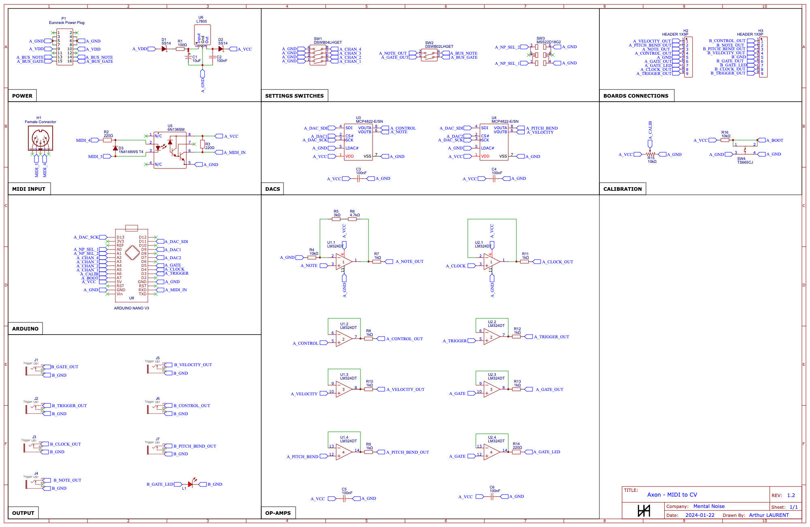

# Mental Noise - Axon - MIDI to CV Eurorack module

This repository contains the code and schematics (EasyEDA format) for the Mental Noise - Axon Eurorack module converting MIDI commands to CV signals you can use to control your Eurorack synth.

I originally made this module to control my modular synth with an Arturia Keystep Pro.  
It is based on the [MIDI2CV project](https://github.com/elkayem/midi2cv) by [Larry McGovern](https://github.com/elkayem).

The Arduino code uses the standard [MIDI library](https://github.com/FortySevenEffects/arduino_midi_library/blob/master/src/MIDI.h) which can be found in the Arduino Library Manager.

The code is written to allow easy customization but it should cover most cases out of the box.

## Module available on Tindie

As I would love for anyone who wants to use this module to be able to, I'm selling it fully assembled on [Tindie](https://www.tindie.com/stores/mentalnoise/).

The goal is not to make lot of benefits on this module, I'm already making it available for free here but if you don't have the skills to do it yourself with all the sources available here then it's a good way for you to get one!

## Specifications

This module is designed to be used in an Eurorack system, it requires a +12V and a ground connection to the power supply.   
If using a 16 to 16 pins eurorack cable, you have the possibility to share the note and the gate on the power bus with compatible modules.

The dimensions are:
- Width: 6HP
- Height: 3U
- Depth: 40mm

The output have different specification:
- Note: 88 keys, 1V/octave using a 12-bit DAC
- Velocity: 0 to 4V
- Control Change: 0 to 4V
- Pitch Bend: 0.5 +/-0.5V
- Gate: 5V for the duration of the key press
- Trigger: 5V for 20ms for each key press
- Clock: 5V for 20ms each quarter note

This module is connected to your MIDI controler using a MIDI cable (5-pin DIN connector).  
The MIDI channel can be selected using 4 DIP switches on the back of the module.

The note priority can be selected using a 3-way switch on the back of the module (last, highesht, lowest).

The note output can be calibrated using a trim pot accessible on the front of the module.

## Schematics

All schematics are available in the [schematics folder](https://github.com/atulrnt/mental-noise-axon/tree/main/schematics).

To import the schematics:  

* Install EasyEDA at [https://easyeda.com/](https://easyeda.com/) and download the standard edition
* Import the schematics in EasyEDA editor by clicking the document icon on the topbar, "Document" > "Open" > "EasyEDA Source", and select the json file

Enjoy!
